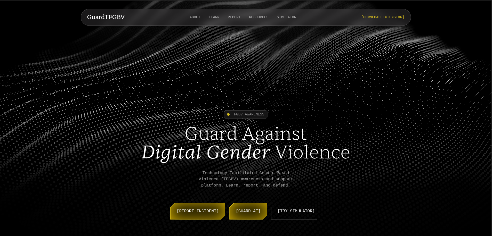
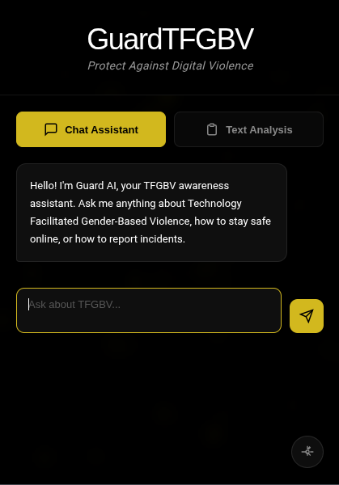

# GuardTFGBV


GuardTFGBV is a comprehensive platform for raising awareness, detecting, and and reporting technology-facilitated gender-based violence.

**Empowering users to recognize, respond to, and report digital abuse against women and girls.**

---

## Table of Contents
1. [Project Overview](#project-overview)
2. [Features](#features)
   - [Website](#website)
   - [Browser Extension](#browser-extension)
3. [Demo](#demo)
4. [Installation](#installation)
   - [Website Setup](#website-setup)
   - [Browser Extension Setup](#browser-extension-setup)
   - [API Configuration](#api-configuration)
5. [Usage](#usage)
6. [Technologies Used](#technologies-used)
7. [Thank You](#thank-you)

---

## Project Overview

GuardTFGBV is an integrated platform designed to **educate**, **simulate**, **detect**, and **report** text-based harassment, coercion, and abusive content against women and girls online.

It consists of:

- **Website**: Focused on awareness, training, and responsible reporting  
- **Browser Extension**: Focused on real-time detection and user guidance  

The project aims to empower users to safely navigate digital spaces, respond confidently to abuse, and report incidents responsibly.

---

## Features

### Website

<p align="center">
  
</p>

- **AI Awareness Chatbot**  
  A large language model that answers questions related to TFGBV, providing guidance and information.

- **Text Simulation**  
  Interactive scenarios where users practice responding to harassment. The system evaluates responses and provides awareness feedback.

- **Reporting Section**  
  Secure form to report incidents to authorities or partner organizations. Reporter identity is optional.

- **Informative Home Page**  
  Includes definitions, types of TFGBV, educational explanations, and an awareness video.

---

### Browser Extension

<p align="center">
  
</p>

- **AI-Powered LLM Assistance**  
  Analyze suspicious text or ask questions for real-time guidance.

- **TFGBV Detector**  
  Detects abusive text, suggests safe responses, and provides a one-click link to reporting.

- **Seamless Integration**  
  Downloadable directly from the website for easy access.

---

## Demo

The live demo and browser extension download are accessible through the website interface.

---

## Installation

### Website Setup

1. Clone the repository or download the ZIP file

  ```bash
  git clone https://github.com/nethen-ui/GuardTFGBV
  ```

2. Extracy the website folder

   - For Windows
     
   ```bash
   Expand-Archive 'GuardTFGBV - website.zip'
   ```
   - For Linux

   ```bash
   unzip 'GuardTFGBV - website.zip'
   ```
   
2. Open your IDE or terminal on the folder
   
   ```bash
   cd 'GuardTFGBV - website'

3. Install Node.js (if not installed yet)
   
   - For Windows
     
   ```powershell
   winget install OpenJS.NodeJS.LTS
   ```
   - For Linux
     
   ```bash
   sudo apt update
   sudo apt install nodejs npm -y
   
4. Install all the packages in the project
   
   ```bash
   npm install --legacy-peer-deps

5. Run the program
   
   ```bash
   npm run dev

6. Open the website on your local host
   
   - Your localhost might look like:
     
     ```bash
     http://localhost:3000

---


### Browser Extension Setup

*To install the extension, you can use the "Download Extension" button on the top right corner of the website, or you can get it from here too:*

After downloading the browser extension, 

1. Go to chrome
2. Open up Extensions > Manage Extensions
3. Turn in the Developer Mode switch on the top right corner
4. Use the Load Unpacked button on the top left corner
5. Choose the file you downloaded

### API Configuration

*To use the chatbot, the TFGBV detector, and the reporting form, you must obtain API keys from EmailJS and Groq*

1. EmailJS:
   
   - Public Key (User ID)
   - Service ID
   - Template ID

2. Groq

   - Groq API Key

**Use the API setup guide readme file to set you up with the API keys**

---

### Usage

- Ask the chatbot about TFGBV.
- Practice responses in the simulation section.
- Paste suspicious text into the extension for real-time detection.
- Report incidents directly through the website form.

---

### Technologies Used

- Next.js - React framework
- Groq Cloud API - for real time analysis and LLM
- EmailJS - for email based reporting system (no server required)
- Chrome extension API - for browser extension

---

### Thank You!
